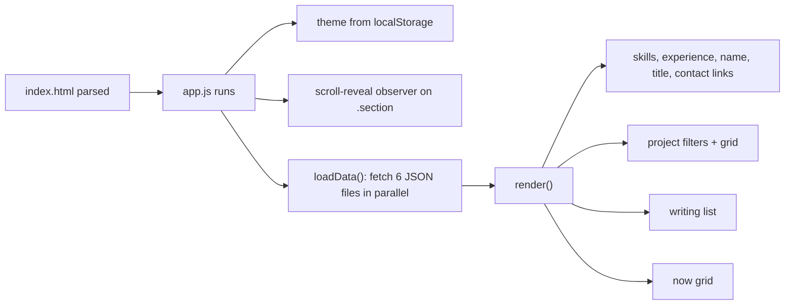

# Architecture

How the portfolio site works under the hood — for whoever edits `app.js`, `style.css` or the data files next. For running and deploying the site, see the [README](../README.md).

## At a glance

A static, build-free site: one HTML page, one stylesheet, one script, and JSON files for content. No framework, no bundler, no npm packages. GitHub Pages serves the `main` branch as-is.

```
index.html        page skeleton + all static copy
style.css         every style, dark theme first, light theme via :root.light
app.js            loads data/*.json and renders the dynamic sections
data/*.json       content (site identity, projects, experience, skills, writing, now)
assets/projects/  real screenshots for project case studies, one folder per project id
```

Because content is loaded with `fetch()`, the page must be served over HTTP. Opening `index.html` from `file://` shows a red "open this folder through a local server" notice instead of content.

## Page load



`loadData()` is async, so everything after it in `app.js` (theme, mobile menu, scroll reveal, hover effects) runs **before** the JSON-rendered elements exist. That is why the scroll-reveal observer only targets `.section` — project cards, timeline items and articles don't exist yet when it runs.

## What is data-driven vs. hardcoded

| Section | Source |
|---|---|
| Hero name eyebrow, page `<title>` | `data/site.json` (`name`, `short_name`) |
| Hero headline, intro, tags, stats, hero visual card | `index.html` |
| About text | `index.html` |
| About skill chips | `data/skills.json` |
| Experience timeline | `data/experience.json` |
| Projects (filters, cards, case-study modal) | `data/projects.json` + `assets/projects/` |
| Lab, Markets sections | `index.html` |
| Writing list + search | `data/articles.json` |
| Now cards | `data/now.json` |
| Contact email, LinkedIn, GitHub | `data/site.json` |
| Contact heading, ticker, footer | `index.html` |

Rule of thumb: anything that is a *list of things* lives in JSON; one-off copy lives in `index.html`.

## Projects

### Schema (`data/projects.json`)

| Field | Required | Used for |
|---|---|---|
| `id` | yes | `data-id` on the card, modal lookup, screenshot folder name, shown as the case ID tag |
| `title`, `short` | yes | card title and description |
| `category` | yes | filter button + which card visual is drawn |
| `status`, `year` | yes | card meta line and modal kicker |
| `stack` | yes | modal tags |
| `tagline` | no | modal subtitle (falls back to `short`) |
| `highlights` | recommended | 4 `[label, value]` stat cards in the modal (the grid is designed for exactly 4) |
| `details` | no | "01 / The idea" (falls back to `short`) |
| `pipeline` | recommended | "02 / Pipeline" step chain; scrolls horizontally when long; the section renders empty without it |
| `problem`, `approach`, `result` | yes | sections 03–05 |
| `screenshots` | no | gallery section, `[{ "src": "assets/projects/<id>/x.png", "caption": "…" }]` |
| `learned` | no | "What I learned" section |
| `link` | yes | footer "GitHub ↗" link; `"#"` renders "Project link coming soon." |
| `visualType` | no | picks a specific card visual within a category (see below) |

Values are inserted into the page with `innerHTML`, unescaped. That means JSON text can contain inline HTML, and also means a literal `<` or `&` in copy must be written as `&lt;` / `&amp;`.

### Filters

Filter buttons are generated from the distinct `category` values in `projects.json`, in order of first appearance, after a fixed "All". Adding a project with a new category adds a new filter button automatically.

### Card layout and ordering

The grid is two columns, and **the first card of the currently filtered list spans both columns** with a taller visual (`.project:first-child`). So array order in `projects.json` decides which project is the big featured card — both under "All" and inside each filter. The `01`, `02`… badges are positions in the filtered list, not stable IDs.

### Card visuals

`projectVisual(p)` in `app.js` decides the visual from `category` and `visualType` only — **never from the card's index**. An earlier version keyed visuals on position, which gave unrelated projects the wrong visual whenever the filter changed.

| `category` | `visualType` | Visual | Generator |
|---|---|---|---|
| `Biomedical` | `"emg"` | EMG burst waveform on an ECG-paper grid | `emgVisual()` |
| `Biomedical` | anything else | STFT/CWT spectrogram heatmap | `spectrogramVisual()` |
| `Markets` | `"options"` | call payoff + Black-Scholes curve + strike | `optionsVisual()` |
| `Markets` | anything else | bars + liquidity line | inline markup |
| any other category | — | on-chain node chain | inline markup (also the fallback for unknown categories) |

The generated visuals are SVG/CSS built from deterministic math (no `Math.random`), so a card looks identical every time the grid re-renders. `optionsVisual()` uses a logistic approximation of the normal CDF — the curve is decorative, not a pricing calculation.

To add a new visual: write a `fooVisual()` that returns a `<div class="visual foo">…</div>` string, add a `visualType` branch in `projectVisual()`, and add its styles next to the other visual blocks in `style.css`.

### Case-study modal

`openProject(id)` rebuilds the modal's HTML on every open and calls `showModal()` on the native `<dialog>`. Sections `01`–`05` are always present; `Screenshots` and `What I learned` are numbered `06`/`07` only when the project has them.

Screenshot `` tags inside the dialog deliberately have **no `loading="lazy"`** — lazy-loading inside a `<dialog>` never triggered in testing, so the images never appeared.

## Styling

### Theme

Colors are CSS custom properties on `:root` (dark, the default) and overridden on `:root.light`. The toggle button flips the `light` class on `<html>` and saves `"light"`/`"dark"` to `localStorage["fazle-theme"]`.

The accent has two values on purpose:

| Token | Dark | Light | Why |
|---|---|---|---|
| `--accent` | `#d8ff4f` | `#567500` | Neon lime is ~1:1 contrast on the cream light background. `#567500` keeps the same hue and saturation, darkened to ≥4.5:1 contrast on all light surfaces (WCAG AA). |

Project card visuals and the hero visual card are **always dark panels**, in both themes, so they reset the accent back to neon:

```css
.light .visual, .light .hero-visual { --accent: #d8ff4f; }
```

Anything added inside those panels should use `var(--accent)` and will get the right color automatically. A few decorative borders and glows still use hardcoded `#d8ff4f` with alpha (`#d8ff4f44` etc.); they are subtle enough to work on both backgrounds.

### File organization and cascade order

`style.css` has grown in layers, and **later blocks intentionally override earlier ones** — order matters:

1. Base styles (top, minified one-line-per-area)
2. `FAZLE PERSONAL LAYER` — hero details, reveal animation
3. `CATEGORY-SPECIFIC PROJECT VISUALS` — chain/market visuals, then the EMG, spectrogram and options visuals
4. `V2 POLISH` — mobile menu, focus rings, animations, reduced-motion
5. `Case-study modal`
6. `Mobile hero composition` — the 760px and 430px hero/mobile rules

When a style "doesn't apply", check for a later rule on the same selector before raising specificity.

### Breakpoints

| Max width | Main changes |
|---|---|
| 900px | single-column layout, nav collapses into the ☰ dropdown |
| 760px | mobile hero: smaller portrait and orbits, compact floating badges |
| 650px | case-study modal: stacked header, 2-column stats, single-column problem/approach |
| 560px | smaller nav and stats, hidden "Let's talk" button, stacked footer and article rows |
| 430px | smallest hero sizing |

Media queries overlap (a 400px screen matches 900, 760, 650, 560 and 430), so the cascade order above decides the winner.

### Hero visual card

The "Signal Lab" and "On-chain" badges sit in the empty bands **above and below** the centered portrait card, not beside it. The portrait is centered in a panel whose width changes with the viewport, so any badge placed beside it collided with the name label somewhere in the 901–1280px range. The vertical bands depend only on the panel's height, which is fixed per breakpoint, so they stay clear at every width. If you change portrait or panel heights, re-check the gap between badges and portrait at 375, 430, 760, 901 and 1280px.

## Known gaps

- `<dialog aria-labelledby="modalProjectTitle">` references an id that no element has; the modal title is a `.modal-title` with no `id`.
- The year in the hero eyebrow (`/ 2026`, in `app.js`) and in the footer (`index.html`) is hardcoded.
- Writing entries show "READ →" but there are no article pages yet; the list is not linked.
- `web3-lab` and `market-notebook` have no repository link yet (`"link": "#"`).
